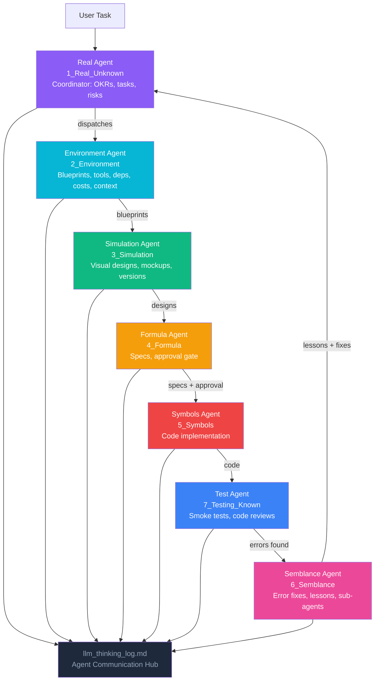

# canva-mcp — Canva Workspace Assistant (PoC)

> https://rifaterdemsahin.github.io/canva-mcp/index.html

A proof-of-concept **MCP (Model Context Protocol) server** that augments the `@canva/cli` MCP capabilities with custom workspace-assistant tools for design brief generation and asset staging — structured on the **Delivery Pilot** 7-stage self-learning framework with 7 dedicated AI agents.

## Quickstart

The MCP server code lives in [`5_Symbols/mcp-server/`](5_Symbols/mcp-server/):

```bash
cd 5_Symbols/mcp-server

# Install dependencies
npm install

# Build TypeScript
npm run build

# Start the custom MCP server (stdio)
npm start

# Development mode with hot-reload
npm run dev

# Launch the native Canva CLI MCP server
npm run mcp
```

See [`5_Symbols/mcp_server.md`](5_Symbols/mcp_server.md) for MCP host configuration (Claude Desktop / Cursor / VS Code) and the PoC checklist.

## Secrets — Azure Key Vault

All secrets are stored in the existing Azure Key Vault **`dp-kv-deliverypilot`** (`/vaults/dp-kv-deliverypilot/secrets`). Do **not** create a new Key Vault.

```bash
# Get a secret
5_Symbols/toolbox/secrets.sh get canva-mcp-CANVA-CLIENT-ID

# Save a secret
5_Symbols/toolbox/secrets.sh set canva-mcp-CANVA-CLIENT-ID "<value>"
```

| Secret (vault name) | Env var | Purpose |
|---|---|---|
| `canva-mcp-CANVA-CLIENT-ID` | `CANVA_CLIENT_ID` | Canva Developer App Client ID |
| `canva-mcp-CANVA-CLIENT-SECRET` | `CANVA_CLIENT_SECRET` | Canva Developer App Client Secret |

## Agentic Workflow



**How the agents communicate**: All 7 agents write their reasoning to `4_Formula/llm_thinking_log.md`. Upstream agents log their decisions; downstream agents read those logs before acting. The Semblance Agent closes the loop by feeding resolved errors and lessons back to the Real Agent.

## 🧠 Cognitive Mapping — 7 Stages to Self-Learning

| Stage | Folder | Cognitive Step | Agent |
|-------|--------|---------------|-------|
| 1 | `1_Real_Unknown` | **Active Ignorance** — State what you don't know | Real Agent |
| 2 | `2_Environment` | **Mental Sandbox** — Build context and constraints | Environment Agent |
| 3 | `3_Simulation` | **Visualization** — Make the invisible visible | Simulation Agent |
| 4 | `4_Formula` | **Synthesis** — Plan, spec, and decide | Formula Agent |
| 5 | `5_Symbols` | **Execution** — Turn plans into reality | Symbols Agent |
| 7 | `7_Testing_Known` | **Validation** — Prove it works | Test Agent |
| 6 | `6_Semblance` | **Feedback Loop** — Learn from errors, improve | Semblance Agent |

## Project Structure

```
canva-mcp/
├── 1_Real_Unknown/        # Problem statement, OKRs, tasks, risks
├── 2_Environment/         # Architecture, setup guides, tools, MCP docs
├── 3_Simulation/          # Design workflow, image prompts
├── 4_Formula/             # Specs, decisions, LLM thinking log
├── 5_Symbols/             # Code — the MCP server lives here
│   ├── mcp-server/        #   TypeScript MCP server (src/, tools/)
│   ├── rules/             #   Coding standards
│   └── toolbox/           #   nav_sync, smoke_test, secrets.sh
├── 6_Semblance/           # Error logs, fixes, lessons learned
├── 7_Testing_Known/       # Smoke tests, validation reports
├── agents.md              # Agent coordination rules
└── index.html             # GitHub Pages entry point
```

## How to use

1. Fork or clone this repo
2. Read `agents.md` for agent coordination rules
3. Read `1_Real_Unknown/prompts.md` for the project management framework
4. Start with `1_Real_Unknown/` — define your problem
5. Let AI agents guide you through each stage

## Links

- **GitHub Pages:** [https://rifaterdemsahin.github.io/canva-mcp/](https://rifaterdemsahin.github.io/canva-mcp/)
- **GitHub:** [canva-mcp](https://github.com/rifaterdemsahin/canva-mcp)
- **Template:** [delivery-pilot-template](https://github.com/rifaterdemsahin/delivery-pilot-template)
- **LinkedIn:** [rifaterdemsahin](https://www.linkedin.com/in/rifaterdemsahin/)
- **YouTube:** [@RifatErdemSahin](https://www.youtube.com/@RifatErdemSahin)

## License

MIT
